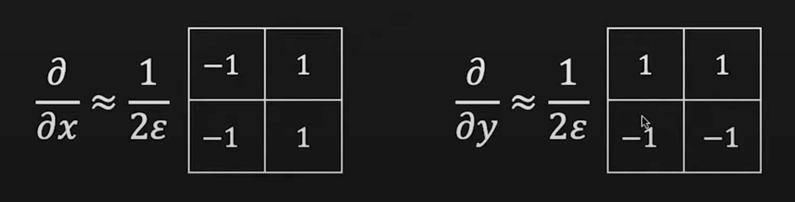

# Edge Detection
## Causes of Edges
<ol>
	<li>Surface Normal Discontinuity (Sudden change in orientation of planes)</li>
	<li>Depth Discontinuity (difference in distance from camera to two objects)</li>
	<li>Surface Reflectance Discontinuity (Change in material)</li>
	<li>Illuminaiton Discontinuity (Shadows or change in light intensity)</li>
</ol>

## What should an edge detector do?
It should provide: 
<ol>
	<li>Edge Postion</li>
	<li>Edge Magnitude (lateral width)</li>
	<li>Edge orientation</li>
</ol>

It shall have:
<ol>
	<li>High sensitivity</li>
	<li>Excellent noise cancellation</li>
	<li>Good Localisation</li>
</ol>

## Gradient Operator

An edge is a rapid change in light intensity in a small region

For a 1D image we simply apply a gradient operator to the given function and the peaks of the gradient map shall give us the edge. The height of the peaks is symbolic of the strength of the edges.

For a 2D image we the gradient operator transforms into a 2 element vector given by [Ix, Iy]. Where I is the intensity map of the image. 

The gradient magnitude is given by ||▽I|| = sqrt(Ix2 + Iy2) and the direction by 𝜭 = tan-1(Iy/Ix)

This gradient operator can be implemented as convolutions:

#### Edge Thresholding:
If the magnitude is greater than a certain T then it is an edge.

Hysterisis: 

Not an edge if < T0

Edge if > T1

If between T0 and T1, edge if connected to another edge.

## Laplacian Operator and 2nd derivative
We will now use the second derivative to detect edges. For this we use the Laplacian operator:

At any edge the laplacian changes suddenly from a positive to a negative value called zero-crossings.

To an image with discrete pixels this can be applied using the follwing formula: 

As a convolution it can be represented as:

However, the image on the right only takes into account the pixels in 4 directions. This is incorrect as edges can also be at 45°. So we have a more accurate convolution on the right which takes into account diagonal pixels too.

### Noise Cancellation
Noise can very disruptive to filters using derivatives as they juct amplify the noise. Noise can be eliminated by first applying the Gaussian filter to smooth the curve and then the derivative/Laplacian.

Rather than applying one by one, these can be combined by matrix multiplication of both the convolutions.

## Difference between Laplacian and Derivative
<ol>
	<li>Laplacian requires only one operation while derivative requires two</li>
	<li>Derivative can tell the strength, direction and location of the image, laplacian only location</li>
</ol>

We thus need a combination of both to have both of their benefits.

## Canny Edge Detector
It includes the following steps:
<ol>
	<li>Smoothen Image with 2d Gaussian filter n𝜎 * I</li>
	<li>Apply the Sobel derivative filter ∇n𝜎 * I</li>
	<li>Obtain the Gradient orientation: </li>
	
	<li>Compute 1D Laplacian in the direction of the gradient.</li>
	
</ol>

The smoothening can be altered for detection of finer or coarse edges.