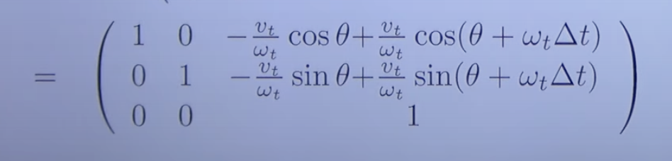

# Extended Kalman Filters
Given: a set of commands, and set of observations

Wanted: map, and object's path

<b>Drawback: </b>This does not improve the previous map. For example, on loop closure all the previous location maps are improved but not in this case.

State space for 2 D plane is xt = (x,y,theta, m1,x, m1,y...mn,y)T

𝜇 = mean and Σ = covariance

Overview of the algorithm is as follows:

The elements on the diagnol are the covariance in a particular element(pose or landmark). Green elements is the covariance relating the pose and landmarks and blue ones are covariances relating the landmarks themselves.

## Filter Cycle
The following steps are involved to update the mean and covariance matrices:
<ol>
	<li>State prediction</li>
	<li>Measurement prediction</li>
	<li>Measurement</li>
	<li>Data Association</li>
	<li>Update</li>
</ol>

## The g function
For a velocity based model the g function is:

Thus we have updated our state function

## Updating the covariance matrix

where Gxt is:

which boils down to 

and this is intuitive as all the linear elements are eliminated which is the very jest of EKF. Thus the covariance only depends on the orientation and not the pose.

Thus our covariance matrix updated comes out to be:

## Correction Step
Range Bearing Observation: Distance and angle <i>zit = (rit, ɸit)T</i>

To initialize a landmark:

Expected Observation:

## Important Notes to keep in mind
<ol>
	<li>measurement update requires the full update of all data[use sparsely]</li>
	<li>Normalize angular components to [-pi, pi]</li>
	<li>Use loop closure carefully as it reduces uncertainties dramatically however the accuracy might still not be correct leading to filter divergence</li>
	<li>It has a cubic complexity based on the number of measurement dimensions and dominated by number of landmarks(n^2)</li>
	<li>The uncertainty of landmarks can decrease as it is seen multiple times but is always greater than the covariance of the pose of robot at the time of first detection of landmark(called initial uncertainty).</li>
</ol>