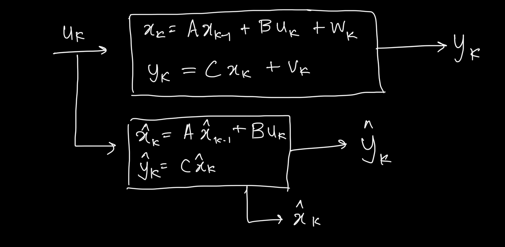

# Kalman Filters

## State Observers
Basically an error based system.

For example we have a quantity that we cannot measure directly but another measurable which is related to the quantity of interest.

We have another actuator input which affects both these quantities.

We build a mathematical nmodel that takes the actuator as input and gives the measurable(Tm) and immeasurable(Tim) as output.

These are just estimates as theoretical does not always coincide with reality. We try to tweak the mathematical model so that Tm converges to the actual measured Tm.

Doing so, Tim would also converge to the actual Tim.

In case we assume a car as a system wherein we have to find the position of the car, the GPS position becomes Tm and predicted becomes Tim.

The predicted and measured data and variance can be converted to probability distributions.

Kalman filter multiplies both the graphs to create a distribution with high probability and less variance.

Kalman Filter: 

Here, Axk-1 + Buk was a previous estimate (xk) (priori estimate) and can then be denoted by x- 

The new estimate obtained is called the posterio estimate

